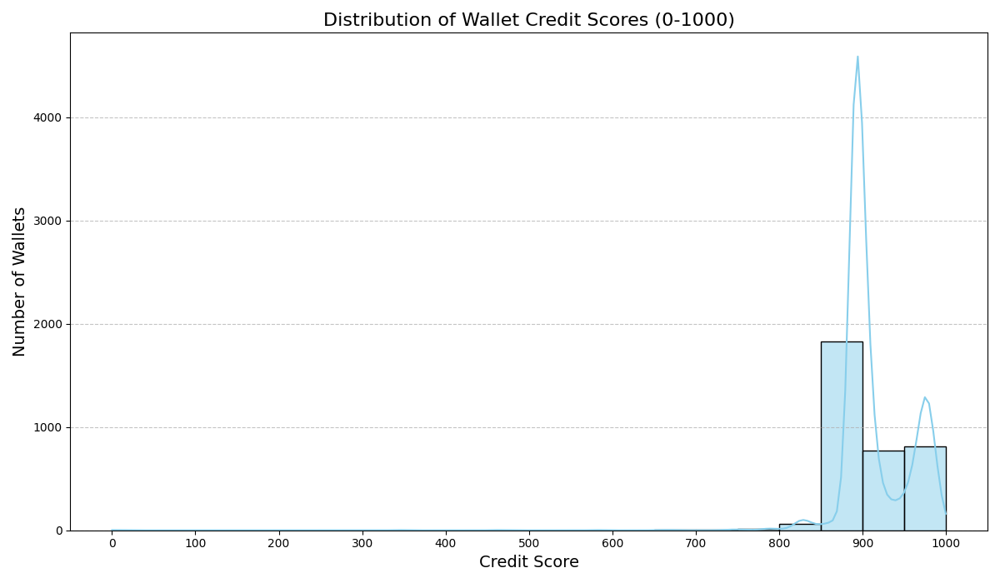

# 📊 Analysis Report – DeFi Wallet Credit Scoring

This document provides insights into the computed credit scores, including score distribution, wallet behavior patterns, and key observations.

---

## 📁 Dataset Summary

- **Wallet Count**: 10,000+ entries
- **Source**: Cleaned Aave V2 transaction data
- **Features Used**:
  - `total_deposits`
  - `total_borrows`
  - `repayments`
  - `liquidations`
  - `borrow_to_deposit_ratio`
  - `repayment_ratio`
  - `score_normalized`

---

## 📈 Credit Score Distribution



### 🧾 Summary:

- Most scores lie between **400–800**
- Peak observed around **650–700**
- Few wallets have extremely low or high scores

---

## 🔍 Score Range Behavior

| Score Range | Wallet Behavior Characteristics                           |
| ----------- | --------------------------------------------------------- |
| **< 400**   | Frequent liquidations, low repayment ratio                |
| **400–600** | Moderate borrowers, irregular repayments                  |
| **600–800** | Consistent deposits, good repayment track, fewer defaults |
| **> 800**   | Excellent history, low risk, almost no liquidations       |

---

## 🔑 Key Insights

- **Repayment Ratio** is the strongest contributor to high scores
- **Liquidation frequency** negatively impacts credit score
- Wallets with high deposits & moderate borrowing performed best
- Several outliers with large volume but poor repayment patterns

---

## 📌 Output Summary

After running `main.py`:

- ✅ `wallet_scores.csv` is generated
- ✅ `credit_score_distribution.png` is saved
- ✅ Each row in the CSV has:

```
wallet_address, credit_score
```

---

## 📌 Limitations

- Assumes input dataset is already cleaned and deduplicated
- Credit scoring logic is rule-based (not ML-driven yet)
- Doesn't incorporate external reputation or token holding data

---

## 🧠 Recommendations

- Migrate to on-chain real-time pipeline using APIs or The Graph
- Use clustering or ML models to enhance scoring credibility
- Create wallet history dashboards to visualize risk in real-time
- Extend beyond Aave (e.g., Compound, Curve, Uniswap behavior)

---

_Prepared by: Kiran Choudhari_  
_Contact: [LinkedIn](https://www.linkedin.com/in/kiran-choudhari-90a4a5248/)_
